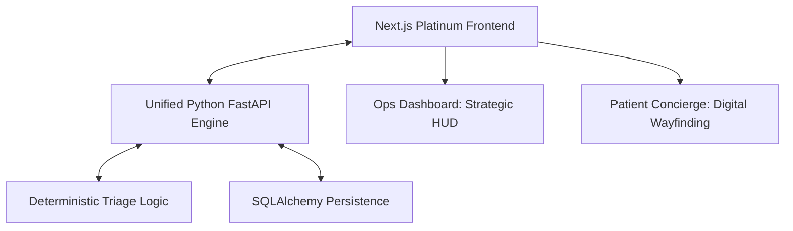

# Smart Queue: Clinical Operations & Throughput Optimization
*Enterprise Intelligence for Modern Hospital Workflow*


**Smart Queue** is a high-fidelity Clinical Operations suite designed to transform chaotic hospital throughput into a predictable, auditable, and staff-controlled diagnostic roadmap. By moving beyond simple FIFO (First-In-First-Out) queues, Smart Queue uses a deterministic prioritization engine to manage high-acuity surges and equipment downtime with surgical precision.

---

## 🏥 Core Operational Pillars

### ⚖️ Clinical Transparency & Auditability
Every sequencing decision is backed by a **Clinical Decision Audit Log**. This provides hospital leadership with a legally defensive and operationally transparent trail of reasoning for every triage escalation.

### 🚨 Operational Resilience
The system is built for the reality of hospital infrastructure. When an MRI suite or CT scanner goes offline, the **Maintenance Alert System** triggers a system-wide re-calculation to prevent throughput collapse.

### 💹 Strategic ROI Analytics
Beyond patient flow, Smart Queue tracks the **Economics of the Unit**. The Unit Performance matrix quantifies reclaimed clinical revenue ($) by optimizing equipment utilization and reducing staff-hour leakage.

---

## 🛠 Strategic Architecture



*   **Frontend:** Next.js with high-fidelity glassmorphism and Framer Motion animations.
*   **Backend:** FastAPI with asynchronous clinical reasoning modules.
*   **Database:** SQLite (SQLAlchemy) for deterministic, portable clinical audit trails.

---

## 🚀 Getting Started

### Initial Bootloader
The entire platform (Frontend + Backend) can be launched via a single command:
```bash
./START.sh
```

### Access Points
*   **Clinical Ops Dashboard:** `http://localhost:3000`
*   **Patient Mobile Concierge:** `http://localhost:3000/patient`
*   **Neural Engine API Docs:** `http://localhost:8000/docs`

---

## 🎭 Demonstration Suite
For a guided experience, refer to the **[Smart Queue Product Demo Hub](./SMART_QUEUE_PRODUCT_DEMO.md)** which includes:
*   **Interactive Slideshow:** Cinematic walkthrough of core workflows.
*   **UAT Validation Guide:** Step-by-step instructions for testing surge scenarios.
*   **Visual Gallery:** High-resolution screenshots of the Platinum v3 design system.

---

## 🧠 Smart Queue Principle
> "The system provides suggestions; the Clinical Staff makes the decisions."

Smart Queue is designed as a **Human-in-the-Loop** system. We emphasize manual clinical overrides and staff authority over autonomous algorithms to ensure patient safety and operational accountability.

---

© 2026 Smart Queue Hospital Platforms. All rights reserved.
